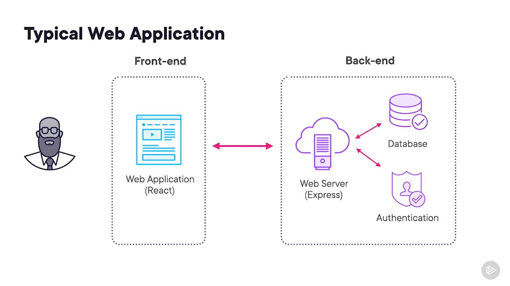
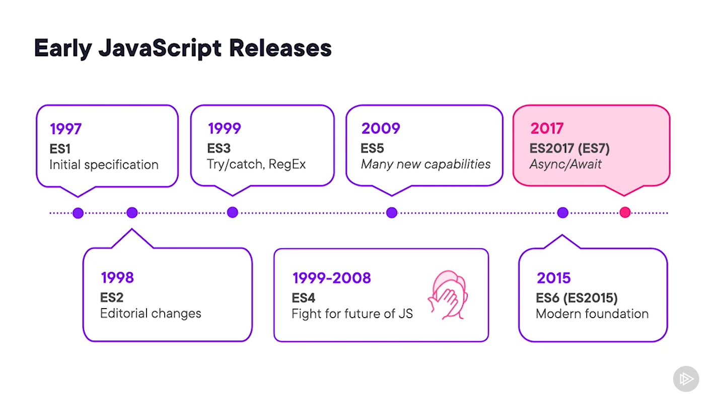

# JavaScript FUNDAMENTALS

https://app.pluralsight.com/library/courses/javascript-big-picture/table-of-contents

https://tuck.cc/jslinks

## 1 Why JavaScript

### 1.1 What is JavaScript

JavaScript is a programming language that can be used to create web applications, backend services, games, mobile applications, and just about anything else you can imagine.

#### What is JavaScript Look like

```JavaScript
import express from 'express';

const app = express();
const port = process.env.PORT || 3000;

app.use('/', (req, res) => {
    res.status(200).send('Hello!');
});

app.listen(port, () => {
    console.log(`Server is listening on port ${port}`)
})
```

#### Why should you care ?

> JavaScript is now used by more than 16.4 million developers globally...making it the world's most popular programming language by a wide margin.
> 
> _ZDNet, Top programming languages: Most popular and fastest growing choices for developers_

> Globally, JavaScript is the most popular language hiring managers look in a candidate.
>
> _2020 HackerRank Developer Skills Report_

### 1.2 Characteristics of JavaScript

- JavaScript is a dynamic programming language
- JavaScript is an interpreted scripting language
- JavaScript was initially dedicated to browsers

## 2 Where is JavaScript Used

### 2.1 Where to find JavaScript ?

- Web application front-end (browser)
- Web application back-end (server)
- Desktop app (i.e. MS VSCode, MS Teams)
- Games are built fully or partially with JavaScript

### 2.2 JavaScript in the Browser

There are several JS engine. The most common:
- **V8**: Google Chrome, MS Edge
- **JavaScriptCore**: Safari
- **SpiderMonkey**: Firefox

JS is commonly combined with HTML and CSS.
- **HTML**: HTML stands for HyperText Markup Language, and it is where we define the structure of any web page
    ```html
    <!DOCTYPE html>
    <html>
        <head>
            <title>HTML Example</title>
        </head>
        <body>
            <p>This is a paragraph within HTML. In addition, you can also define links to get to other pages like <a href="https://pluralsight.com">Pluralsight</a></p>
        </body>
    </html>
    ```
- **CSS**: CSS stands for Cascading Style Sheets, and it enables us to define how our HTML should look when it is rendered in the browser. Before CSS it was difficult to have design style in HTML pages.
    ```css
    body {
        background-color: white;
        margin-top: 10px;
    }

    p {
        color: red;
        font-size: 40px;
    }

    a {
        text-decoration: none;
    }
    ```   

JS allows users to interact with the web pages.

```html
<head>
    <script>
        function onClick() {
            const m = document.getElementById("menu");
            if (m.style.display === 'none') {
                m.style.display = 'block';
            } else {
                m.style.display = 'none';
            }
        }
    </script>
    <body>
        <button onclick="onClick()">Toggle Menu</button>
        <div id="menu">Site Menu</div>
    </body>
</head>
```

Popular Web App Frameworks based on HTML/CSS/JS:
- **React** mainained by Meta
- **Angular** maintained by Google
- **Vue.js** and **Svelte** maintained by different core teams of open source contributors

**JSX** is an extension for JavaScript, most commonly used in the React framework, that enables you to write HTML-like markup directly within JavaScript.

### 2.3 JavaScript on the Server

**Node.js** is a cross-platform, open-source JavaScript runtime environment that can run on Windows, Linux, Unix, macOS, and more. Node.js runs on the V8 JavaScript engine, and executes JavaScript code outside a web browser.

Node.js lets developers use JavaScript to write command line tools and for server-side scripting. The ability to run JavaScript code on the server is often used to generate dynamic web page content before the page is sent to the user's web browser. Consequently, Node.js represents a "JavaScript everywhere" paradigm, unifying web-application development around a single programming language, as opposed to using different languages for the server- versus client-side programming.

**Package Manager**. In terms of software development, a package manager is a tool that enables you to install and manage software written by other developers into your own software projects. **npm** is the official package manager for node.js.

### 2.4 Full Stack JavaScript




### 2.5 Additional JavaScript Use Cases

- Desktop applications (Electron framework)
- Mobile applications (React Native framework)
- IoT experiences
- Configure and deploy cloud infrastructure

## 3 How is JavaScript Versionned ?

### 3.1 JavaScript History

JavaScript was created in 1995 by Brendan Eich while he was working at Netscape Communications Corporation. Initially called Mocha, it was later renamed to LiveScript and finally JavaScript to capitalize on the popularity of Java at the time. It quickly became the standard for web development, allowing for dynamic and interactive web pages. In 1996, JavaScript was adopted by Microsoft for its Internet Explorer browser, leading to widespread adoption. It was standardized under the name ECMAScript by the ECMA International organization in 1997. Since then, JavaScript has evolved significantly, with major updates like ES6 (ECMAScript 2015) bringing modern programming features and capabilities. Today, JavaScript is a cornerstone of web development and is also used in server-side programming, mobile app development, and more.

ECMA, or the European Computer Manufacturers Association, is an international standards organization for information and communication systems. Founded in 1961, ECMA develops standards and technical reports to facilitate and improve the use of information and communication technology.

In the context of JavaScript, ECMA is known for its development and maintenance of the ECMAScript standard, which is the official specification for scripting languages, including JavaScript. The first edition of ECMAScript was published in 1997, based on JavaScript.

### 3.2 Who governs JavaScript ?

JavaScript is governed by the ECMAScript standard, which is maintained by TC39, a committee of the European Computer Manufacturers Association (ECMA). TC39, or Technical Committee 39, is composed of a group of JavaScript developers, engineers, and representatives from major tech companies such as Microsoft, Google, Apple, Mozilla, and others. This committee is responsible for evolving and improving the ECMAScript standard, which defines the core features and functionalities of JavaScript.

The process involves proposing new features, discussing and refining them through various stages, and eventually integrating them into the ECMAScript standard. This collaborative effort ensures that JavaScript continues to evolve in a way that meets the needs of the developer community and remains compatible across different platforms and environments.

Node.js is governed under the Node.js Project which has its own technical commitee.

### 3.3 JavaScript Releases



JavaScript is always back-compatible.

Node.js has LTS.

### 3.4 Extending JavaScript

**Polyfill**. A polyfill is a piece of code used to provide modern functionality on older browsers that do not natively support it. The reason why polyfills are not used exclusively is for better functionality and better performance. native implementations of APIs can do more and are faster than polyfills.

**Transpiler**. A transpiler is a translator that takes the source code of a program written in a programming language as its input and produces an equivalent source code in the same or a different programming language.