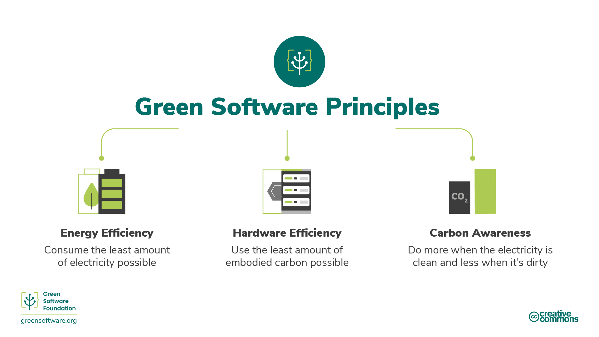
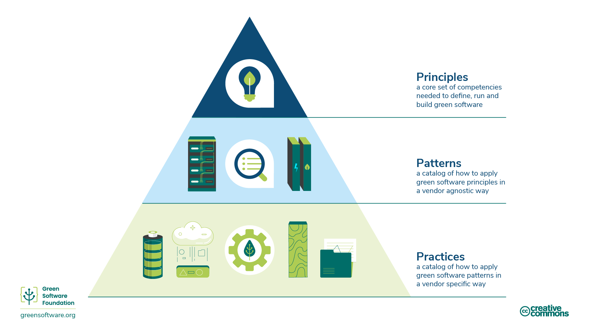

# INTRODUCTION

## 1 Welcome to LFC131

### 1.1 What is Green Software?

Green software is an emerging discipline at the intersection of climate science, software design, electricity markets, hardware, and data center design. The Green Software Practitioner training shows you how to define, build, and run green software applications. This training lays out the guidelines to help create a shared understanding of what it means to be a green software practitioner, irrespective of the application domain, industry, organization size or type (cloud vendor or self-hosted), programming language or framework.

Green software is carbon-efficient software, meaning it emits the least carbon possible. Only three activities reduce the carbon emissions of software; **energy efficiency**, **carbon awareness**, and **hardware efficiency**. This training will explain all of these concepts, how to apply them to your processes and how to measure them, as well as some of the international guidelines and organizations that guide and monitor this space.

### 1.2 Who Should Read This?

Anyone involved in the process of building, deploying, or managing software. By studying these principles, a green software practitioner can make decisions that have a meaningful impact on the carbon pollution of their applications.

### 1.3 History

In 2019 the original eight principles of green software engineering were released. This 2022 update of the principles took on feedback received over the years, merging some principles and adding a new one regarding understanding climate commitments.

### 1.4 How to be a Green Software Practitioner

The following training covers 6 key areas that a green software practitioner should know:
- **Carbon Efficiency:** Emit the least amount of carbon possible.
- **Energy Efficiency:** Use the least amount of energy possible.
- **Carbon Awareness:** Do more when the electricity is cleaner and do less when the electricity is dirtier.
- **Hardware Efficiency:** Use the least amount of embodied carbon possible.
- **Measurement:** What you can't measure, you can't improve.
- **Climate Commitments:** Understand the exact mechanism of carbon reduction.

Each of these chapters will introduce some new concepts and explain in detail why they are important in terms of the climate, and how you can apply them to your green software practices.

### 1.5 Principles, Patterns, and Practices

This course's key areas and content describe the principles of green software, a core set of competencies needed to define, run and build green software.

A green software [pattern](https://patterns.greensoftware.foundation/) is a specific example of how to apply one or more principles in a real-world example. Whereas principles describe the theory that underpins green software, patterns are the practical advice software practitioners can use in their software applications today. Patterns are vendor-neutral.

A green software practice is a pattern applied to a specific vendor's product and informs practitioners about how to use that product in a more sustainable way.

**Practices should refer to patterns that should refer to principles.**

The green software foundation also publishes a [catalog of vendor-neutral green software patterns](https://patterns.greensoftware.foundation/) across various categories.

## 2 Glossary

### 2.1 Acronyms

| Acronym | Term | Definition |
| ------ | ------ | ------ |
| CFE | Carbon-free energy | This term is usually used to talk about the percentage of renewable energy used as a proportion of the total energy used. |
| CH4 | Methane | A common gaseous hydrocarbon that has a warming effect 25 times that of CO2.|
| CO2 | Carbon dioxide | One of the most common greenhouse gases. |
| CO2eq / CO2-eq / CO2e | Carbon dioxide equivalent | Carbon is used as a common form of measurement for all greenhouse gases. This unit of measurement indicates the potential impact of non-CO2 gases on global warming in carbon terms. |
| COP | Conference of the Parties |	An annual event involving all parties in the United Nations Framework Convention on Climate Change.|
| gCO2eq/kWh | grams of carbon per kilowatt hour | The standard unit of carbon intensity is gCO2eq/kWh, or grams of carbon per kilowatt hour. |
| GHGs | Greenhouse gases |	Greenhouse gases are a group of gases that trap heat from solar radiation in the Earth's atmosphere. These gases act as a blanket, increasing the temperature on the surface of the Earth.|
| GWP | Global warming potential | The potential impact of greenhouse gases on global warming. Measured in terms of CO2e.|
| IPCC | Intergovernmental Panel on Climate Change | The objective of the IPCC is to provide governments at all levels with scientific information that they can use to develop climate policies.|
| J | joules | Energy is measured in joules (J). |
| kWh | kilowatt hours | Energy consumption is measured in kilowatt hours (kWh).|
| MMTCDE | Million metric tonnes of carbon dioxide equivalent |Measurement term for CO2eq. |
| NDC | Nationally Determined Contribution | The means by which members of the Paris Climate Agreement are expected to update their progress.|
| PCA | Paris Climate Agreement | An international treaty agreed in 2015 by 196 parties and the UN to reduce the Earth's temperature increase. |
| PPA | Power Purchase Agreement | A contract you sign with a power plant to purchase RECs.|
| PUE | Power usage effectiveness |	The metric used to measure data center energy efficiency.|
| REC | Renewable Energy Credit | Renewable energy credits (also known as renewable energy certificates) represent the energy generated by renewable energy sources.|
| SBTi | Science Based Targets initiative | A body that defines and promotes best practice in science-based target setting. For example, creating the standards for net zero. |
| SCI | Software Carbon Intensity | A standard which gives an actionable approach to software designers, developers and operations to measure the carbon impacts of their systems.|
| SF6 | Sulfur hexafluoride | A man-made gas used as an electrical insulator that has a warming effect 23,500 times that of CO2. |
| UNFCCC | United Nations Framework Convention on Climate Change | A group created to achieve the stabilization of greenhouse gas concentrations in the atmosphere at a level that would prevent dangerous interference with the climate system.|
| VCM | Voluntary Carbon Market | A decentralized market where private actors voluntarily buy and sell carbon credits that represent certified removals or reductions of greenhouse gases (GHGs) in the atmosphere.|
| VCS | Verified Carbon Standard | A standard for certifying carbon emissions reductions.|
| WMO | World Meteorological Organization | A specialized agency of the United Nations whose mandate covers weather, climate and water resources.|

### 2.2 Useful Terms

- **[Carbon Intensity](https://learn.greensoftware.foundation/practitioner/carbon-awareness/#carbon-intensity)** - Measures the amount of greenhouse gases emitted per unit of electricity produced.
- **[Demand Shaping](https://learn.greensoftware.foundation/practitioner/carbon-awareness/#demand-shaping)** - The strategy of moving workloads to regions or times when the carbon intensity is less
- **[Greenhouse Gas protocol](https://ghgprotocol.org/)** - The most widely used and internationally recognized greenhouse gas accounting standard.
- **[Value chain emissions](https://www.cisl.cam.ac.uk/education/graduate-study/pgcerts/value-chain-defs)** - These are scope 3 emissions according to the GHG protocol, and the most significant source of emissions. They encompass the full range of activities needed to create a product or service, from conception to distribution.
- **[Energy proportionality](https://learn.greensoftware.foundation/practitioner/energy-efficiency/#energy-proportionality)** - Measures the relationship between power consumed by a computer and the rate at which useful work is done (its utilization).
- **[Static power draw](https://learn.greensoftware.foundation/practitioner/energy-efficiency/#static-power-draw)** - This refers to how much electricity is drawn when a device is in an idle state.
- **[Embodied carbon (also known as "embedded carbon")](https://learn.greensoftware.foundation/practitioner/hardware-efficiency/#embodied-carbon)** - The amount of carbon pollution emitted during the creation and disposal of a device.