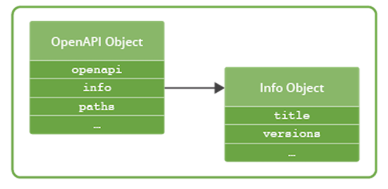
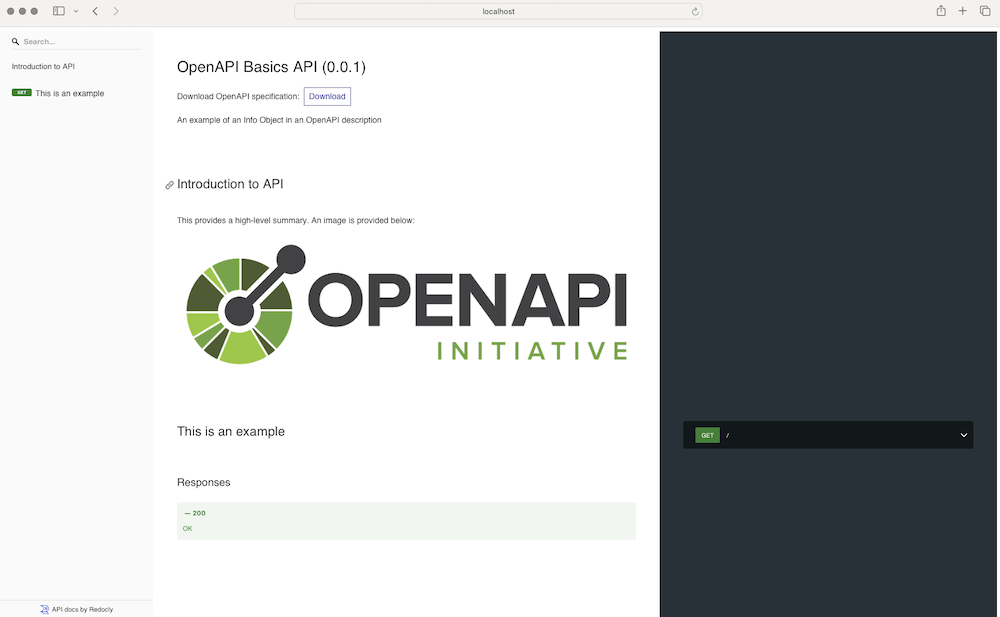

# OPENAPI BASICS

## 1 Introduction

### 1.1 Chapter overview

The OpenAPI Specification provides a consistent syntax language to describe the shape of an API, providing a bridge between the expression of an API in code and the HTTP-based services it represents.

Understanding this structure and the syntax of the OpenAPI Specification is critical to using it effectively, as a tool to communicate with API consumers.

### 1.2 Learning objectives

By the end of this chapter, you should be able to:
- Explain the basics of the HTTP-based APIs that typify the API Economy
- Describe how OpenAPI maps the features of HTTP-based APIs to its description language
- Identify the features OpenAPI provides that reflect the needs of API consumers
- Explain the basic structure of an OpenAPI description and why this structure provides an effective means of communication

## 2 HTTP, APIs and OpenAPI

### 2.1 The role of HTTP

In the previous chapter, we discussed the growth of the API Economy and how this growth has been driven by an increasing number of web APIs that are built on HTTP. There’s no surprise that HTTP is the go-to choice as the protocol for providing web APIs. HTTP is the "language" of the web and providing APIs over the Internet is the de facto choice for getting these products and services to target audiences quickly, effectively, and with minimal “plumbing” outside of the API providers stack. Web APIs routinely also implement JavaScript Object Notation (JSON) as the means to encode request and response payloads. These conventions have grown organically and reflect the preferences of both providers and consumers of web APIs.

OpenAPI is, therefore, primarily a means to describe HTTP-based APIs that largely, but not exclusively, provide JSON payloads. It does this by mapping the semantics of HTTP, either natively or in [the REST architectural style described by Roy Fielding](https://ics.uci.edu/~fielding/pubs/dissertation/rest_arch_style.htm). Of course, there are other features implemented in OpenAPI that provide useful features for API providers to accurately describe their APIs.

### 2.2 Mapping OpenAPI to HTTP

If you consider OpenAPI in terms of how it maps to HTTP, it can be qualified as follows:
- **Uniform Resource Identifiers.** HTTP is based on a system of Uniform Resource Identifiers (URIs). URIs incorporate a given domain name or IP address and the path at the server the resource is hosted at to provide a unique reference to a resource or entity. In OpenAPI this is represented by a Path, which is defined using a Paths Object and contains one or more Path Item Objects.

- **Operation Object.** HTTP provides methods that can be used to retrieve or change the state of a given resource or entity - GET, POST, PUT, and so on. Therefore, a Path Item Object implements an Operation Object that provides the means to describe how an HTTP method is implemented in the API.

- **Parameter Object.** Each Operation Object references an array of Parameters Objects that reflect the different types of parameters an HTTP URI can support - query parameters, HTTP header fields that form the HTTP header, and cookies. OpenAPI also extends this to define Path parameters that describe a placeholder for a fragment of the URI that can be replaced by the API consumer.

- **Request Body Object.** Some HTTP methods (most notably POST) support sending a message payload to the server, which can be acted on to create a resource or execute a given operation. In OpenAPI this maps onto a Request Body Object.

- **Responses Object.** HTTP defines a huge number of possible response status codes, each providing a predefined coarse-grained indicator of the success or failure of the requested operation. The Operations Object provides a Responses Object that describes the return codes defined by the API and their associated properties (note there is an open-world assumption that other return codes are possible due to the distributed nature of the Internet).

- **Response Object.** The Responses Object references one or more Response Objects that describe the response payloads. Each response is qualified by the content type, with HTTP headers described as required.

These mappings demonstrate the strong association between HTTP and OpenAPI and the basis of the model underpinning the OpenAPI language. While there are protocols overlaying HTTP that are more difficult to map - for example, representing WebSockets in a way that is not overly complex - the close alignment with HTTP means that OpenAPI can cover a wide range of design choices.

OpenAPI also uses several supporting technologies to underpin the Specification:
- **JSON and YAML:** An OpenAPI description document is a JSON object that can be serialized in either JSON or YAML (both are supported as first-class citizens).
- **JSON Schema:** JSON Schema is used to provide the means to define the properties of an object - defined as a [Schema Object](https://spec.openapis.org/oas/v3.1.0#schema-object) in OpenAPI. A Schema Object is used to describe the format of request and response payloads, parameters, and headers.
- **Markdown:** CommonMark (a specific dialect of markdown) provides the syntax for adding descriptive text to an OpenAPI description document intended for human beings to read.provides the syntax for adding descriptive text to an OpenAPI description document intended for human beings to read.

These features provide the basis of both the syntax and structure for creating a usable API description document. The specification language itself, however, is the key to providing what API providers need to describe their APIs effectively. We'll walk through each object in turn and discuss its relevance to accurately describing an API.

### 2.3 Versions of OpenAPI

Before breaking down the structure of OpenAPI it is important to highlight the versions of the Specification currently available:
- Swagger (in its version Swagger 2.0) was retrospectively labeled OpenAPI 2.0 after it was donated by SmartBear in 2015.
- OpenAPI 2.0 became the baseline for 3.0, which was published in 2017.
- The latest version, [OpenAPI Specification v3.1](https://spec.openapis.org/oas/v3.1.0.html), was published in February 2021.

A new major version, currently codenamed [Moonwalk](https://www.openapis.org/blog/2023/12/06/openapi-moonwalk-2024), is being developed. The goal is to make version 4 of OpenAPI generally available in 2024.

Throughout the course, wherever we refer to OpenAPI we mean version 3.1. All versions up to 3.1, however, mirror the features of HTTP as described above. If you are using a version earlier than 3.1 the object definitions may differ slightly, but the relationship to HTTP remains largely the same.

## 3 High-level structure

### 3.1 Structure overview

An OpenAPI description is a document following the rules of the OpenAPI Specification. It has a standard structure with each part designed to describe a part of the API. Several objects are provided at the root of the description document. The OpenAPI Object describes the root of the document and references several objects that include:
- **Info Object:** Provides high-level information about the API being described.
- **Paths Object:** Describes the operations the API provides.
- **Components Object:** The object that houses all reusable objects within a given OpenAPI description.

For the majority of users, these objects reference the most frequently used objects in OpenAPI. We’ll look at each of these in more detail as we progress through the chapter.

### 3.2 Providing information through the info object

It’s no surprise that providing information to end users of an API description document is served by the Info Object. It provides the means to describe high-level information including the title, summary, and description information that applies to the entire API and other usage aspects, such as the license and the terms of service.

The Info Object also provides a version property, which allows API providers to label a given document with a version number, often using Semantic Versioning. This feature of OpenAPI is important as it provides a standardized location for an unequivocal “stamp” that allies a given OpenAPI description to the operations, behaviors, and data that an API consumer will expect to find at a provider’s API:


### 3.3 Examples of the Info Object

The Info Object is also notable as the description property supports the means to add extended additional information using Markdown. The code snippet below shows a minimal example of an Info Object:
```markdown
info:
  title: OpenAPI Basics API
  description: An example of an Info Object in an OpenAPI description
  version: 0.0.1
```

We can very quickly extend the example description over multiple lines and implement other Markdown features such as tables and an image:
```markdown
info:
  title: OpenAPI Basics API
  description: |
    An example of an Info Object in an OpenAPI description

    ## Introduction to API

    This provides a high-level summary. An image is provided below:

    

    These are the services levels available:

    | Name | Description |
    | --- | --- |
    | Basic | Free tier available to all consumers |
  version: 0.0.1
```

The important point here is that tooling can then render this information in a human-friendly format. The screenshot below uses Redoc as an example:


The Info Object provides the means to extend the headline information that an OpenAPI description can deliver. This feature provides considerable capabilities for API providers to use OpenAPI as the spine of their documentation, pulling together both human- and machine-oriented information into a single format. Many API providers use this feature to considerable effect, which we'll look at in more detail in a later chapter.

## 4 Describing API Shape

### 4.1 URLs, paths and methods

